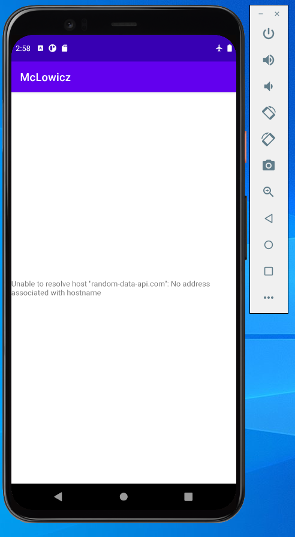
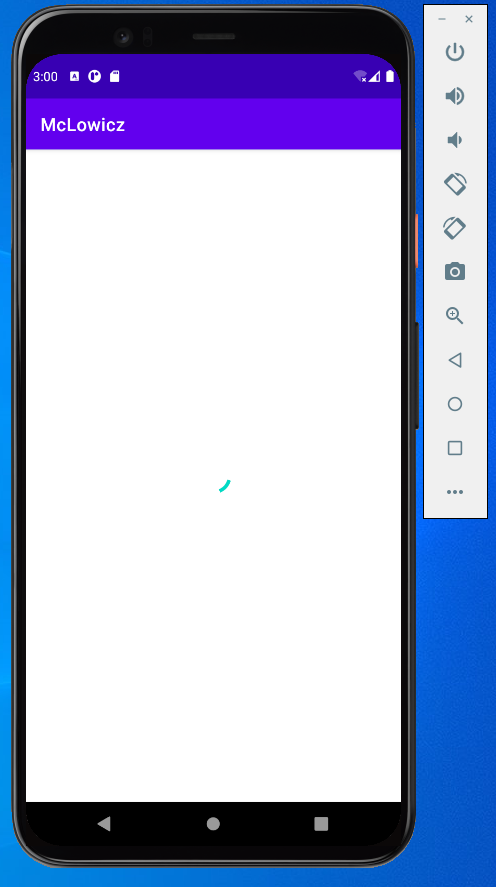
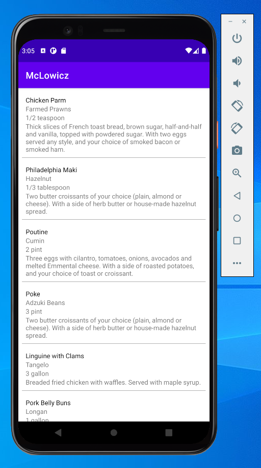

# Off line caching mechanism recipe.

Have you ever approached a complex problem relative to the off line functionality of your Android app ?

Mentioned problem carry many narrow cases that need to be firstly deeply considered and planned before the successful implementation.

Narrow cases that need to be handled by the off line caching mechanism "under the table":

## 1) User launched the app for the first time without Internet connection -> there is no data locally.

App firstly try to find the data in the local database. As we know in this particular example there is no data. Secondly, the app will try to fetch data from the network rest api. System will throw exceptions that need to be handled.

## 2) User launched the app for the first time with the Internet connection -> no local data.

As we know from the previous stage there is no data in the local database yet. System, this time successfully retrieve Internet connection and receive payload data from the rest api. Fetched data is immediately saved into the local database and displayed to the UI. By the time of the fetching the loading state occurs that also should be considered.

##   3) User launched the app on time with an Internet connection -> local data cache.

System found data locally and immediately displayed it to the user. Under the table in the background, the system should fetch data from the remote source and implemented logic should decide which item needs to be overwritten.

##   4) User lost Internet connection -> local data cache.

System retrieves data from the local database. In the background it will try to synchronize data with the rest api with a nice and smooth way that will not disturb a user experience.

## 5) Caching strategy.

Logical algorithm for making decisions of which item should be overwritten in the local database.

## NetworkBoundResource

The idea of the NetworkBoundResource helper function is to observe the database for the resource type object. If there is no resource locally then the algorithm will switch to the next stage and it will try to fetch data from the network. Successfully fetched data is immediately saved into the local database and triggers the stream of resources to the UI. In the scenario where network connection is off or it is broken network bound resource algorithm will return resource object with the handled error.

## NetworkBoundResource

The idea of the **NetworkBoundResource** helper function is to observe the database for the resource type object. If there is no resource locally then the algorithm will switch to the next stage and it will try to fetch data from the network. Successfully fetched data is immediately saved into the local database and triggers the stream of resources to the UI. In the scenario where network connection is off or it is broken network bound resource algorithm will return resource object with the handled error.

Deeper look at the NetworkBoundResource algorithm.

	inline fun <ResultType, RequestType> networkBoundResource(  
	    crossinline query: () -> Flow<ResultType>,  
	    crossinline fetch: suspend () -> RequestType,  
	    crossinline saveFetchResult: suspend (RequestType) -> Unit,  
	    crossinline shouldFetch: (ResultType) -> Boolean = { true }  
	) = flow {  
	  val data = query().first()  
	  
	  val flow = if (shouldFetch(data)) {  
	        // display cache data while loading new one from the api  
	  emit(Resource.Loading(data))  
	        try {  
	            // save fetched data into local db  
		  saveFetchResult(fetch())  
	            // display fetched data from the local db  
		  query().map { Resource.Success(it) }  
	  } catch (throwable: Throwable) {  
	          // pass error and display cache data from the local db  
		  query().map { Resource.Error(throwable, it) }  
	  }  
	    } else {  
	        query().map { Resource.Success(it) }  
	  }  
		emitAll(flow)  
	}

It implements four methods:  

**a)  query** -> This method is responsible for observing the stream of resources from the local database.  
**b) fetch** -> Is a coroutine suspend function that triggers a network request to the server to obtain the resources.  
**c) shouldFetch** -> In this method should be implemented the logic that should decide about resources overwriting strategy. By default it will update all resources locally.  
**d) saveFetchResult** -> This method is triggered after the resources are successfully fetched from the remote server. Is responsible for updating/inserting resources downloaded from the network into the local database.

The algorithm will handle complex problems in the background returning a LiveData object that can be observed for any data changes.  

The example project uses NetworkBoundResource algorithm and the following ingredients to fulfill off line app mechanism requirements recommended nowadays by the **Google** in 2021:

- Kotlin  
- Dagger Hilt  
- ViewBinding  
- Retrofit  
- Room  
- LiveData  
- Coroutines  
- Coroutine flow  
- MVVM  
- Repository pattern

  

### a) Off Internet connection and no local data (first launch).  

### b) On Internet, fetching data. Loading state.

### c) On or Off Internet connection while there is data saved locally. Stream of data presented in the UI it always come from the local database.

**Bonne appétit !**